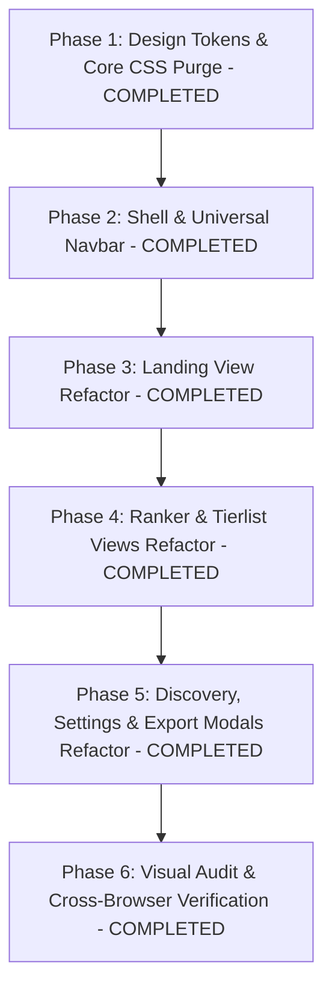

# AniHub UI Audit & Anti-AI Slop Refactor Plan

## 1. Executive Summary & Core Mandate

**Role**: Senior UI Engineer & Design Systems Specialist.  
**Core Objective**: Refactor and polish the entire AniHub interface to eliminate generic "AI template slop" and replace it with clean, deliberate, production-grade styling based on strict, systematic design constraints.  
**Strict Guardrail**: **Do NOT rewrite business logic, state handling, event listeners, or API integrations.** The sole focus is styling, layout, aesthetics, typography, token binding, and visual density.

---

## 2. Code Audit & Purge Rules (What to Strip)

Every component and stylesheet across AniHub will be audited against these 5 purge rules:

### 1. Purge Arbitrary & Default Gradients
- **Strip**:
  - All background blur blobs and floating glow orbs (`w-[45vw] blur-[120px] animate-float`).
  - Hero radial glows and background gradient overlays.
  - Multi-stop gradient-clipped text (`hero-gradient-text` spanning indigo, sky, and emerald).
  - Rainbow gradient buttons (`bg-gradient-to-r from-primary to-violet-600` and `from-emerald-500 to-teal-600`).
- **Replace With**: Solid, restrained background colors bound to `--bg` (`#0b1622`) and `--surface` (`#151f2e`), with crisp borders.

### 2. Purge Inconsistent Sizing & Arbitrary Radius
- **Strip**:
  - Full pill buttons (`rounded-full`) on interactive controls, badges, and filters.
  - Childish `rounded-3xl` (24px) on toolbars, cards, and modal dialogs.
  - Arbitrary arbitrary Tailwind values (e.g. `p-[17px]`, `gap-[13px]`, `text-[11px]`).
- **Replace With**:
  - Strict, unified radius: `rounded-md` (6px) for buttons, badges, inputs; `rounded-lg` (8px) for cards, dialogs, tier rows. Maximum radius is 8px.
  - Standard Tailwind scale: `p-2`, `p-3`, `p-4`, `p-6`, `gap-2`, `gap-3`, `gap-4`.

### 3. Purge Generic Icons & Emoji
- **Strip**:
  - Meaningless emoji (🔥, 🚀, ⭐, ✨).
  - Pinging radar dots (`animate-ping`) and gimmick badges.
  - Decorative icons with mismatched sizing.
- **Replace With**:
  - Clean, functional SVG / FontAwesome icons sized strictly at 16px (`w-4 h-4`) or 18px (`w-[18px] h-[18px]`).
  - High-contrast, semantic icon coloring bound to `--text-muted` or `--accent`.

### 4. Purge Excessive Shadows & Fuzzy Glassmorphism
- **Strip**:
  - Heavy drop-shadows on flat elements (`shadow-soft`, `shadow-hover`, `shadow-glass`).
  - Washed-out frosted glass (`backdrop-blur-md bg-white/80`).
- **Replace With**:
  - Subtle hairline borders (`border border-border` or `border border-border/40`).
  - Shadows restricted exclusively to elevated floating layers (modals, dropdown menus, active popovers).

### 5. Fix Aspect Ratios & Card Density
- **Strip**:
  - Arbitrary square (1:1) or wide (16:9) media containers for anime, manga, and cover art.
  - Cavernous, low-density cards with excessive empty margins.
- **Replace With**:
  - Standard vertical poster aspect ratio: strictly `aspect-[2/3]` (or `aspect-[3/4]` for compact tier chips).
  - High-density responsive grids (`grid grid-cols-2 sm:grid-cols-3 md:grid-cols-4 lg:grid-cols-6 gap-4`).

---

## 3. Design Tokens to Enforce

All components will strictly bind to systematic CSS variables and matching Tailwind semantic configuration:

### 3.1 CSS Variables (`style.css` & `:root`)

```css
:root {
  /* Dark Mode (Default Studio Theme) */
  --bg: #0b1622;             /* Deep slate app background */
  --surface: #151f2e;        /* Primary card & section surface */
  --surface-hover: #1f2d40;  /* Card hover state */
  --surface-active: #27374d; /* Active pressed state */
  --border: #223147;         /* Hairline card/separator border */
  --border-muted: #1c283a;   /* Subtle divider border */
  --text-primary: #edf1f5;   /* Headings and primary text */
  --text-muted: #8ba0b2;     /* Subtext, metadata, secondary stats */
  --accent: #3db4f2;         /* Single primary accent color (AniList sky blue) */
  --accent-hover: #2ba2e0;   /* Accent hover state */
  --accent-fg: #ffffff;      /* Contrast text on accent */
  --radius-sm: 4px;
  --radius-md: 6px;
  --radius-lg: 8px;
}

/* Crisp Light Mode Support */
html:not(.dark) {
  --bg: #f5f7fa;
  --surface: #ffffff;
  --surface-hover: #edf2f7;
  --surface-active: #e2e8f0;
  --border: #dbe2ea;
  --border-muted: #e9eef4;
  --text-primary: #0f172a;
  --text-muted: #5a6e85;
  --accent: #0284c7;
  --accent-hover: #0369a1;
  --accent-fg: #ffffff;
}
```

### 3.2 Tailwind Semantic Mapping (`index.html`)

```javascript
tailwind.config = {
  darkMode: 'class',
  theme: {
    extend: {
      colors: {
        'bg': 'var(--bg)',
        'surface': 'var(--surface)',
        'surface-hover': 'var(--surface-hover)',
        'border': 'var(--border)',
        'border-muted': 'var(--border-muted)',
        'text-primary': 'var(--text-primary)',
        'text-muted': 'var(--text-muted)',
        'accent': 'var(--accent)',
        'accent-fg': 'var(--accent-fg)',
      },
      borderRadius: {
        'DEFAULT': '6px',
        'sm': '4px',
        'md': '6px',
        'lg': '8px',
        // Max 8px radius allowed across the entire app
      },
      fontFamily: {
        'sans': ['"Inter"', 'sans-serif'],
        'mono': ['"JetBrains Mono"', 'monospace'],
      }
    }
  }
};
```

---

## 4. Layout, Spacing & Typography Restructuring

### 4.1 Rhythm & Spacing
- **Normalized Section Margins**: Snap to `py-8` to `py-12` max. Eliminate giant, cavernous SaaS hero gaps (`pt-28 pb-32`).
- **Standardized Content Shell**: Every view container strictly bounded to `max-w-7xl mx-auto px-4 md:px-6`.
- **Performance**: Delete universal selector transition (`* { transition: ... }`). Replace with explicit, targeted utility transitions (`transition-colors duration-150`).

### 4.2 Typography Hierarchy
- **Headings**: Tight, bold, disciplined tracking: `font-bold tracking-tight text-text-primary`.
- **Subheadings & Section Labels**: `text-xs font-semibold uppercase tracking-wider text-text-muted`.
- **Metadata, Tags, Statistics**: Compact, high-readability text: `text-xs font-medium text-text-muted`.
- **Rank Badges & Counts**: Monospaced precision typography: `font-mono text-xs font-bold`.

### 4.3 Information Density
- Transform loose 1-to-3 card stacks into authentic responsive grids: `grid grid-cols-2 sm:grid-cols-3 md:grid-cols-4 lg:grid-cols-6 gap-4`.
- Enforce strict poster ratios (`aspect-[2/3]`) for all anime covers with zero image distortion (`object-cover`).

---

## 5. File-by-File Implementation Blueprint

| File | Target Refactors (Preserving All Logic) |
|---|---|
| [index.html](file:///f:/OneDrive%20-%20twilightx/OneDrive/Documents/GitHub/Anihub/index.html) | • Remove ambient background blur orbs (`animate-float`).<br>• Add Google Font `JetBrains Mono` alongside `Inter`.<br>• Update `tailwind.config` to bind semantic tokens (`bg`, `surface`, `border`, `text-primary`, `text-muted`, `accent`). |
| [style.css](file:///f:/OneDrive%20-%20twilightx/OneDrive/Documents/GitHub/Anihub/style.css) | • Purge universal `* { transition: ... }` rule to eradicate input/drag latency.<br>• Inject `:root` CSS variables for tokens.<br>• Strip fuzzy `.glass-panel` and neon glow classes.<br>• Restrict borders to hairline `border: 1px solid var(--border)`.<br>• Clamp all border-radius to 6px–8px (`rounded-md`, `rounded-lg`). |
| [js/components/navbar.js](file:///f:/OneDrive%20-%20twilightx/OneDrive/Documents/GitHub/Anihub/js/components/navbar.js) | • Reduce header height to a compact 52px.<br>• Remove gradient background on brand icon; use solid accent container.<br>• Replace loose navigation pills with a tight segmented control (`[ Hub ] [ AniRanker ] [ AniTierlist ]`) using `rounded-md` and hairline borders.<br>• Use 16px icons (`w-4 h-4`) and muted metadata badges. |
| [js/views/landing.js](file:///f:/OneDrive%20-%20twilightx/OneDrive/Documents/GitHub/Anihub/js/views/landing.js) | • **Purge Hero Slop**: Strip gradient headline (`hero-gradient-text`), pinging radar dots, and giant empty whitespace.<br>• **Restructure Layout**: Turn the hero into an editorial workspace launcher (`max-w-7xl mx-auto py-8`).<br>• **Refactor Cards**: Replace `rounded-3xl` cards and rainbow buttons with clean `bg-surface border border-border rounded-lg p-6` cards with solid action buttons (`bg-accent text-accent-fg hover:bg-accent/90 rounded-md`).<br>• **Refactor Previews**: Fix preview posters to strictly `aspect-[2/3]` with monospaced rank stamps.<br>• **Tabular Matrix**: Clean, dense, monospaced comparison table with hairline dividers. |
| [js/views/ranker.js](file:///f:/OneDrive%20-%20twilightx/OneDrive/Documents/GitHub/Anihub/js/views/ranker.js) | • Replace `rounded-3xl` toolbar with a crisp `rounded-lg bg-surface border border-border p-4` bar.<br>• Remove rainbow/glowing dropzone states; replace with high-contrast hairline highlight (`border-accent bg-accent/5`).<br>• Grid mode: Enforce strict `aspect-[2/3]` on tiles with monospaced rank markers (`#01`, `#02`).<br>• List mode: Clean, high-density rows with sharp borders and muted metadata (`text-xs text-text-muted`). |
| [js/views/tierlist.js](file:///f:/OneDrive%20-%20twilightx/OneDrive/Documents/GitHub/Anihub/js/views/tierlist.js) | • Normalize tier rows to `rounded-lg border border-border` with solid, readable tier header badges.<br>• Cards inside tiers: Strictly `aspect-[2/3]` or `aspect-[3/4]` with 6px radius (`rounded-md`).<br>• Unranked pool: High-density staging tray with clean filter chips and compact action buttons (`rounded-md text-xs`). |
| [js/components/discovery.js](file:///f:/OneDrive%20-%20twilightx/OneDrive/Documents/GitHub/Anihub/js/components/discovery.js) | • Search & sync tabs: Clean segmented bar with `rounded-md` active state.<br>• Result grid: Responsive `grid grid-cols-2 sm:grid-cols-3 md:grid-cols-4 lg:grid-cols-6 gap-3`.<br>• Result cards: Clean `aspect-[2/3]` posters, monospaced score tags (`★ 88`), tight typography, no glowing shadows. |
| [js/components/tier-settings.js](file:///f:/OneDrive%20-%20twilightx/OneDrive/Documents/GitHub/Anihub/js/components/tier-settings.js) | • Modal dialog: Disciplined `rounded-lg bg-surface border border-border` with subtle elevation shadow.<br>• Color swatches and input fields: Snapped to standard `rounded-md` and standard spacing (`gap-2`, `p-2`). |
| [js/components/export-modal.js](file:///f:/OneDrive%20-%20twilightx/OneDrive/Documents/GitHub/Anihub/js/components/export-modal.js) | • Studio inspector layout: Solid surfaces, clear preview frame, `rounded-md` resolution chips.<br>• Export action buttons: Solid high-contrast buttons (`bg-accent text-accent-fg rounded-md`), zero rainbow glows. |

---

## 6. Execution Phases



### Phase Details & Execution Status:
- **Phase 1: Tokens & CSS Cleanup [COMPLETED]**
  - Updated `index.html`: injected `JetBrains Mono` and `Inter` from Google Fonts; removed floating ambient background blur orbs; configured strict semantic Tailwind color tokens (`bg`, `surface`, `border`, `text-primary`, `text-muted`, `accent`).
  - Cleaned `style.css`: purged universal selector `* { transition: ... }`; established `:root` and `html:not(.dark)` variables; enforced `aspect-ratio: 2 / 3` on posters; replaced fuzzy glassmorphic and neon classes with solid surface tokens and 1px hairline borders.
- **Phase 2: Shell & Universal Navbar [COMPLETED]**
  - Refactored `js/components/navbar.js`: reduced header height to a crisp 52px (`h-[52px]`); replaced gradient logo with solid accent mark (`w-7 h-7 rounded-md`); replaced loose pill buttons with a segmented control (`[ Hub ] [ AniRanker ] [ AniTierlist ]`) bounded by hairline borders; standardized 16px icons.
- **Phase 3: Landing View Transformation [COMPLETED]**
  - Refactored `js/views/landing.js`: stripped hero gradient headlines, pinging radar dots, and empty whitespace; transformed hero into an editorial curator launcher (`max-w-7xl mx-auto py-8`); converted cards to `rounded-lg bg-surface border border-border`; enforced `aspect-[2/3]` on preview artwork with monospaced rank stamps; replaced generic buzzwords with a dense monospaced comparison matrix.
- **Phase 4: Workspaces (Ranker & Tierlist) [COMPLETED]**
  - Refactored `js/views/ranker.js`: replaced bloated toolbar with `rounded-lg bg-surface border border-border`; clamped view switches to `rounded-md`; enforced strict `aspect-[2/3]` on grid tiles with monospaced rank markers; cleaned list rows with hairline dividers; normalized touch avatar.
  - Refactored `js/views/tierlist.js`: normalized toolbar; clamped tier rows to `rounded-md border border-border`; clamped tier covers to `aspect-[2/3]` with `rounded-sm`; streamlined unranked staging pool and search controls.
- **Phase 5: Modals & Discovery Engine [COMPLETED]**
  - Refactored `js/components/tier-settings.js`: clamped modal to `rounded-lg bg-surface border border-border shadow-elevated`; standardized color swatches and inputs to `rounded-md`.
  - Refactored `js/components/export-modal.js`: clamped modal shell, tab switches, resolution selects, dropzone hover highlights, and canvas watermark to semantic tokens and `rounded-md` geometry.
  - Refactored `js/components/discovery.js`: standardized search, sync, season, and custom upload tab panels; converted result grid to `grid-cols-2 sm:grid-cols-3 md:grid-cols-4 lg:grid-cols-6 gap-3`; enforced `aspect-[2/3]` posters, monospaced score tags (`★ 88`), and solid accent buttons.
  - Refactored `js/toast.js`: converted toasts to `rounded-md shadow-elevated bg-surface border border-border` with monospaced typography and standard 16px icons.
- **Phase 6: Visual Audit & Verification [COMPLETED]**
  - Verified 0 remaining arbitrary color gradients, 0 ambient blur blobs, 0 childish `rounded-3xl` cards, 0 pill buttons (only 6px status dots).
  - Preserved 100% of all functional logic, state management, drag-and-drop algorithms, AniList API calls, and localStorage persistence.
